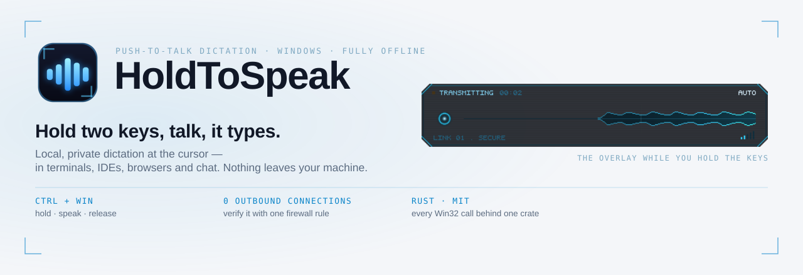
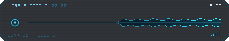
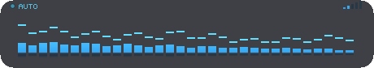

<picture>
  <source media="(prefers-color-scheme: dark)" srcset="assets/readme/banner-dark.svg">
  
</picture>

<p align="center">
  <a href="https://github.com/rootMonsteR/holdtospeak/releases/latest"></a>
  <a href="https://github.com/rootMonsteR/holdtospeak/actions/workflows/ci.yml"></a>
  
  <a href="LICENSE"></a>
  <a href="PRIVACY.md"></a>
</p>

**Hold Ctrl + Win anywhere in Windows, speak, let go — your words appear at the cursor in whatever
app you were already using.** No account, no cloud, no telemetry. After a one-time model download it
works with the network cable unplugged, and it is built so you can *verify* that rather than take
our word for it ([PRIVACY.md](PRIVACY.md)).

<p align="center">
  
  <br>
  <sub>The overlay while you hold the keys — a live voiceprint, the active cleanup mode, a signal meter. Gone the moment you let go.</sub>
</p>

> **Status: early.** The dictation core works and is used daily by its author; a settings window
> (tray icon → **Settings…**) covers hotkeys, overlay, microphone, dictionary and diagnostics. Code
> signing is still to come. Bug reports welcome; rough edges expected.

## Why this exists

Cloud dictation is fast and good — and it ships your microphone to someone else's computer. That's
a non-starter in a lot of workplaces (legal, medical, finance, anywhere under an NDA), and it's
just unnecessary: a 2024-era speech model runs comfortably on a normal CPU.

## What it does

- **Works in the apps that usually break.** Terminals, WSL, IDEs, browsers, chat apps, remote
  sessions — via a per-target injection chain rather than clipboard-paste-and-hope.
- **Never rewrites your commands.** Focused on a terminal or code editor? Dictation drops to
  verbatim automatically, so `kubectl get pods -n kube-system` stays exactly that.
- **Refuses password fields.** Detected live via UI Automation — if the focused control is a
  credential field, nothing is typed.
- **Learns your jargon.** `learn cube ctl => kubectl` and it's fixed permanently, in plain text
  you can edit.
- **Tells you when it can't help.** Elevated window? You get "text kept, not inserted" — never a
  silently swallowed sentence.

## Install

Requires **Windows 10/11 (x64)** and a microphone.

Grab the installer or the portable ZIP from the
[latest release](https://github.com/rootMonsteR/holdtospeak/releases/latest). The installer is
per-user — it lands in `%LOCALAPPDATA%` and never asks for admin rights. The release notes carry
the SHA-256 of every artifact.

On first launch it downloads the speech model (~460 MB, once) and tells you it's doing so. After
that it needs no network at all.

> **The binaries are not code-signed yet**, so Windows SmartScreen will show a
> "Windows protected your PC" warning on first run — click **More info → Run anyway**, or verify
> the download against the published hash. Signing costs money and is on the list; until then,
> building from source below is the paranoid-friendly path.

A winget manifest is submitted and awaiting review
([microsoft/winget-pkgs#420408](https://github.com/microsoft/winget-pkgs/pull/420408)); once it
lands, `winget install rootMonsteR.HoldToSpeak` will work too.

### From source

```
git clone https://github.com/rootMonsteR/holdtospeak && cd holdtospeak
pwsh -File scripts/fetch-sherpa.ps1     # GPL-free speech runtime (~7 MB)
cargo build --release -p nib-core -p nib-asr-sidecar
cargo run --release -p nib-core -- --sidecar native
```

## Use

Global hotkeys — these work in any app:

| | |
|---|---|
| **Ctrl + Win** (hold) | dictate — speak, then release |
| **Ctrl + Alt + M** | cycle cleanup mode |
| **Ctrl + Alt + O** | cycle overlay theme |
| **Ctrl + Alt + Q** | quit |

Plus the tray icon (modes, overlay themes, **Settings…**, quit), and in the console window: `m` to cycle mode,
`learn <heard> => <meant>` to teach it a word permanently, `q` to quit.

Rebind in `%APPDATA%\HoldToSpeak\hotkeys.toml` — `off` disables one:

```toml
ptt         = "Ctrl+Win"      # modifiers only
cycle_mode  = "Ctrl+Alt+M"
cycle_style = "Ctrl+Alt+O"
quit        = "Ctrl+Alt+Q"
```

### Cleanup modes

- **Raw** — exactly what you said, plus your dictionary. Forced automatically in terminals/IDEs.
- **Auto** — light tidy: `um`/`uh` removed, sentence casing, terminal punctuation.
- **Polish** — Auto plus conversational scaffolding removed: *"I'm just testing this, like, you
  know, testing the software and stuff, just to make sure…"* becomes *"I'm just testing this,
  testing the software, just to make sure…"*

All three are rule-based and run entirely offline, so they can only ever **delete** filler — they
can never invent or reword anything. Polish only removes a marker when it's comma-delimited, which
is what keeps *"I like this"* and *"you know the answer"* intact.

### Overlay themes

Four looks for the push-to-talk overlay. Every one tells you the same three things — that the mic
is being heard, which cleanup mode is active, and how strong the signal is — so switching theme
changes how it looks, never what it tells you. Cycle live with **Ctrl + Alt + O** or from the
tray; set a default with `overlay_style` in `%APPDATA%\HoldToSpeak\settings.toml`.

<table>
  <tr>
    <td align="center"><br><sub><b>HUD</b> (default) — tactical comms: voiceprint, timecode, mode callout</sub></td>
    <td align="center"><br><sub><b>Volt</b> — an electric beam with lightning forks that ride your voice</sub></td>
  </tr>
  <tr>
    <td align="center"><br><sub><b>Wave</b> — flowing layered waveform, tinted by the active mode</sub></td>
    <td align="center"><br><sub><b>Bars</b> — frequency spectrum, the classic visualizer</sub></td>
  </tr>
</table>

## Privacy you can check

The whole claim is in [PRIVACY.md](PRIVACY.md), including the one network request the app ever
makes. The short version is a firewall rule: after the one-time model download, block the app from
the network entirely — it keeps working.

```powershell
New-NetFirewallRule -DisplayName "Block HoldToSpeak outbound" -Direction Outbound `
  -Program "$env:LOCALAPPDATA\HoldToSpeak\HoldToSpeak.exe" -Action Block
```

## How it works

```
Ctrl+Win ──► keyboard hook ──► always-on mic ring (400 ms look-back, so your first
                                word is never clipped)
                                     │  release
                                     ▼
                          local ASR (Parakeet, CPU) ──► deterministic cleanup
                                     │
                                     ▼
                    injected at the cursor (route chosen per target app)
```

Rust throughout, with every Win32 call confined to one crate behind a trait wall — enforced in CI,
which is also what makes a macOS port a swap rather than a rewrite.

## Contributing

Issues and PRs welcome. `cargo test --workspace` and `cargo run -p xtask -- check-layering` must
pass; CI runs fmt, clippy (`-D warnings`), tests, and the layering check.

## License

[MIT](LICENSE). Third-party components and the speech model's required attribution are listed in
[THIRD-PARTY-NOTICES.md](THIRD-PARTY-NOTICES.md).
